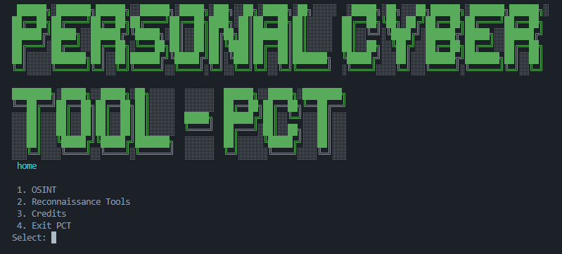

# Personal Cyber Tool (PCT) 🛡️

[](https://www.python.org/)

**Personal Cyber Tool (PCT)** is an advanced, modular Python-based Open-Source Intelligence (OSINT) framework. Designed for security researchers, penetration testers, and digital investigators, PCT streamlines information gathering, footprinting, and digital reconnaissance by aggregating multiple OSINT search vectors into a single, cohesive command-line interface.

---

## ⚙️ Installation & Setup

Ensure you have **Python 3.8 or higher** installed on your system. Follow these steps to set up the environment locally:

1. **Clone the repository:**
   ```bash
   git clone https://github.com/yourusername/Personal-Cyber-Tool.git
   cd Personal-Cyber-Tool
   ```

2. **Create a virtual environment (recommended):**
   ```bash
   python3 -m venv venv
   source venv/bin/activate  # On Windows use: venv\Scripts\activate
   ```

3. **Install dependencies:**
   ```bash
   pip install -r requirements.txt
   ```

---

## 💻 Usage

PCT provides an interactive CLI interface as well as direct command flags for rapid assessment.

To launch the interactive main menu:
```bash
python Personal-Cyber-Tool
```

## ⚠️ Disclaimer

This tool is created for **educational purposes, authorized security testing, and defensive research only**. The authors and maintainers assume **no liability** and are not responsible for any misuse or damage caused by this program. Users must ensure they have explicit, written permission from target owners before conducting any reconnaissance activities.
---

## 📷 Screenshot


---

## 📄 License

Distributed under the MIT License. See `LICENSE` for more information.
